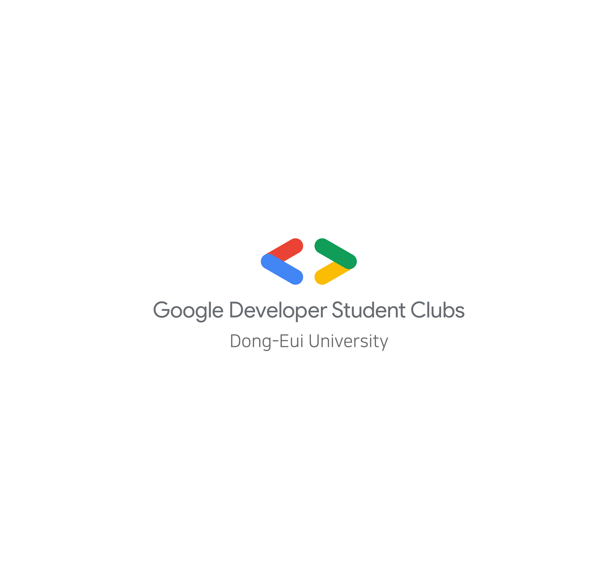

 

  

<h2 align="middle">GDSC TIL Study</h2>

Today I Leared

  
  

 

### 진행 일정

- 1월 한달 간(1/3~1/28, 1/31은 설날연휴)
- 평일 21:00-24:00(3시간)

### 진행 방식

- 모(여서)각(자)코(딩)를 기본으로 합니다.
- 깃헙이나 블로그 등 다양한 각자의 방식으로 TIL을 작성합니다.
- 다음날 스터디 시작 전까지 전날 TIL을 PR 보냅니다.

### PR 방법

1. **새로운 Branch 생성**
2. **TIL repo를 본인 계정에 fork**
3. `fork`된 repository `clone`
4. **README.md를 작성!**
5. TIL소개와 url을 작성한 README.md 파일을 작성하고 `commit` `push`
6. **웹사이트로 본인 계정의 `fork` 된 repo를 갑니다.**
7. **Contribute → Open pull request 로 PR을 합시다**
   - base repo : `원본repo` base : `be/a/gitusername` ← head repo : `여러분fork한repo` compare : `여러분fork한repo`

### 참고하면 좋은 자료

[GitHub에서 협업을 위한 remote repository와 upstream 이해하기](https://pers0n4.io/github-remote-repository-and-upstream/)
